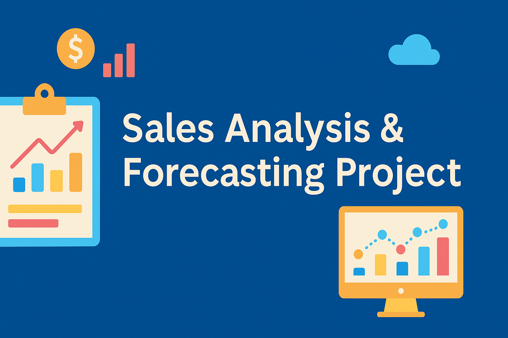

  

# 📊 Sales Analysis & Forecasting Project

This project analyzes historical sales data to uncover trends, identify top-performing products/categories, and forecast future sales using ARIMA and SARIMA time-series models.

## 🔹 Key Features
- Monthly sales analysis (line + bar charts)
- Best-selling month across all years
- Best-selling month for each year
- Year-over-year sales growth visualization
- 12-month forecast using ARIMA and SARIMA
- Top 5 products by revenue
- Top 5 categories by revenue
- Business insights & actionable recommendations

## 🔹 Tools & Libraries
- Python
- Pandas
- Matplotlib
- Statsmodels (ARIMA, SARIMA)
- Google Colab

## 🔹 Project Structure
1. **Exploratory Sales Analysis**
2. **Time-Series Forecasting**
3. **Category-Level Revenue Analysis**
4. **Product-Level Revenue Analysis**
5. **Insights & Recommendations**

## 📝 Conclusion
This project demonstrates real-world business analytics involving:
- Trend analysis  
- Forecasting  
- Revenue optimization insights  
- Data storytelling
